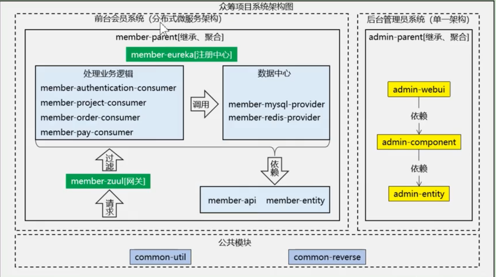
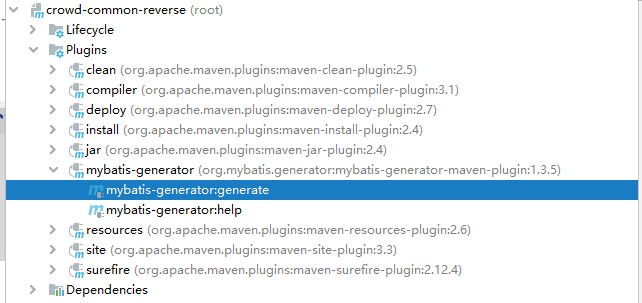
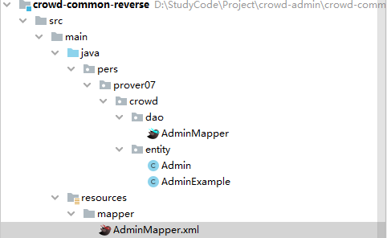
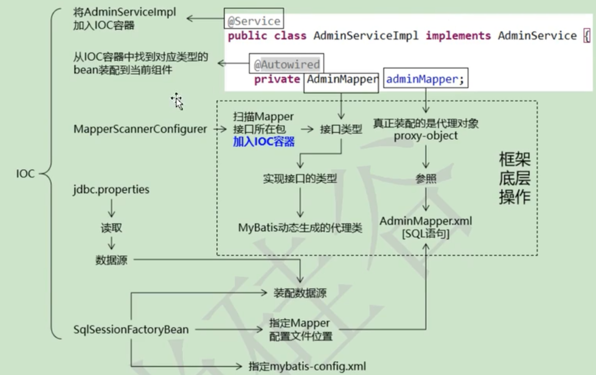
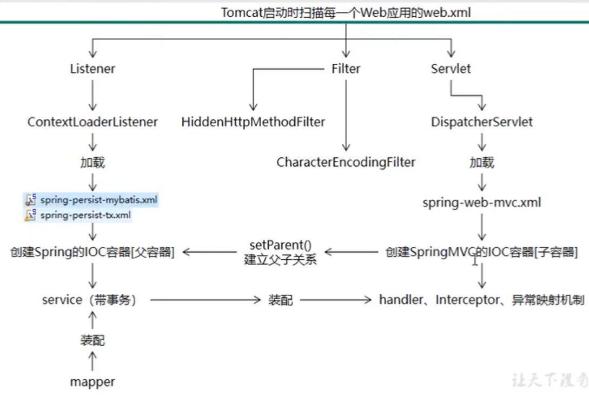
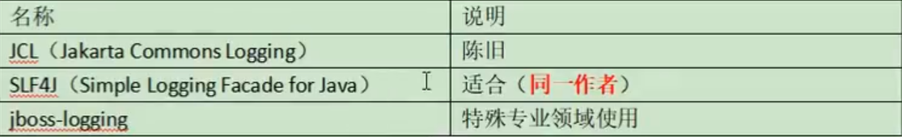
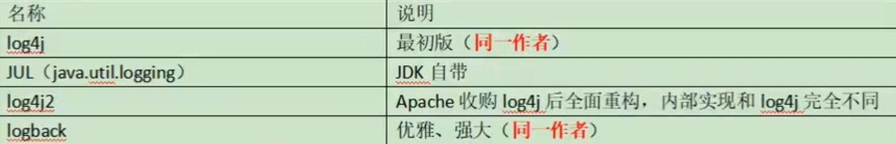
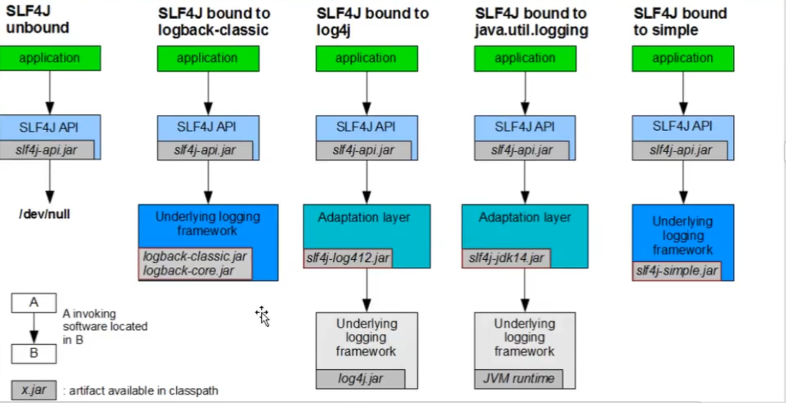
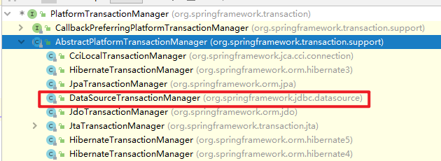
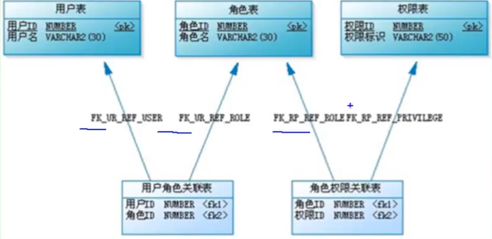

## 项目介绍

> 该项目为尚筹网项目的后台管理员系统

简介：尚筹网项目是一个众筹平台，主要作用是帮助创业者发布创业项目，向大众募集启动资金的融资平台，整个项目分为**前台会员**(微服务)和**后台管理**(SSM)两个模块

学习资料：https://www.bilibili.com/video/BV1bE411T7oZ

### 架构



## 前端

### JS 多层解构赋值

```javascript
const {data: { success, message, data }} = await getTree()
```

### JS 实现深度优先遍历(DFS)

```javascript
let stack = [data]
while (stack.length) {
    let menuItem = stack.pop()
    
    // 业务逻辑处理放在这里
    menuItem.open = true
    
    let menuItemChildren = menuItem.children
    for (let i = menuItemChildren.length - 1; i >= 0; i--) {
        stack.push(menuItemChildren[i])
    }
}
```

### JS 逗号操作符

作用：**逗号操作符** 对它的每个操作数求值（从左到右），并返回最后一个操作数的值。

实例：通过该操作符可以实现从一个对象中的属性继承一部分后生成一个新对象

```javascript
const extendObjAttr = (sourceObj, attrNameArr) => attrNameArr.reduce(
    (iter, val) => (val in sourceObj && (iter[val] = sourceObj[val]), iter),
    {}
)

let dataObj = extendObjAttr(menuNodeInfo, ['id', 'name', 'icon', 'url']) 
```

## 后端

### 基于 Maven 的 MyBatis 的逆向工程

1. 引入依赖

   ```xml
   !-- 依赖 MyBatis 核心包 -->
   <dependencies>
       <dependency>
           <groupId>org.mybatis</groupId>
           <artifactId>mybatis</artifactId>
           <version>3.5.4</version>
       </dependency>
   </dependencies>
   <!-- 控制 Maven 在构建过程中相关配置 -->
   <build>
       <!-- 构建过程中用到的插件 -->
       <plugins>
           <!-- 具体插件，逆向工程的操作是以构建过程中插件形式出现的 -->
           <plugin>
               <groupId>org.mybatis.generator</groupId>
               <artifactId>mybatis-generator-maven-plugin</artifactId>
               <version>1.3.5</version>
               <configuration>
                   <configurationFile>
                       <!-- 这里是配置generatorConfig.xml的路径，这里空着不写表示默认在resources目录下找generatorConfig.xml文件 -->
                   </configurationFile>
                   <verbose>true</verbose>
                   <overwrite>true</overwrite>
               </configuration>
               <dependencies>
                   <dependency>
                       <groupId>mysql</groupId>
                       <artifactId>mysql-connector-java</artifactId>
                       <version>8.0.19</version>
                   </dependency>
               </dependencies>
           </plugin>
       </plugins>
   </build>
   ```

2. 在 `resources` 目录下创建 `generatorConfig.xml`

   ```xml
   <?xml version="1.0" encoding="UTF-8"?>
   <!DOCTYPE generatorConfiguration
           PUBLIC "-//mybatis.org//DTD MyBatis Generator Configuration 1.0//EN"
           "http://mybatis.org/dtd/mybatis-generator-config_1_0.dtd">
   
   <generatorConfiguration>
       <!-- context 是逆向工程的主要配置信息 -->
       <!-- id：配置名称 -->
       <!-- targetRuntime：设置生成的文件的 mybatis 版本 -->
       <context id="default" targetRuntime="MyBatis3">
   
           <!-- optional, 旨在创建class时，对注释进行控制 -->
           <commentGenerator>
               <property name="suppressDate" value="true" />
               <!-- 是否去除自动生成的注释 true：是 ： false:否 -->
               <property name="suppressAllComments" value="true" />
           </commentGenerator>
   
           <!--jdbc的数据库连接，以下为MySQL版本8以上的JDBC驱动-->
           <jdbcConnection driverClass="com.mysql.cj.jdbc.Driver"
                           connectionURL="jdbc:mysql://localhost:3306/crowd_admin?serverTimezone=UTC"
                           userId="root"
                           password="root">
           </jdbcConnection>
   
           <!--非必须，类型处理器，在数据库类型和java类型之间的转换控制-->
           <javaTypeResolver>
               <!-- 默认情况下数据库中的 decimal，bigInt 在 Java 对应是 sql 下的 BigDecimal 类 -->
               <!-- 不是 double 和 long 类型 -->
               <!-- 使用常用的基本类型代替 sql 包下的引用类型 -->
               <property name="forceBigDecimals" value="false" />
           </javaTypeResolver>
   
           <!-- targetPackage：生成的实体类所在的包 -->
           <!-- targetProject：生成的实体类所在的位置 -->
           <javaModelGenerator targetPackage="pers.prover07.crowd.entity" targetProject="src/main/java">
               <!-- 是否允许子包 -->
               <property name="enableSubPackages" value="false" />
               <!-- 是否清理从数据库中查询出的字符串左右两边的空白字符 -->
               <property name="trimStrings" value="true" />
           </javaModelGenerator>
   
           <!-- targetPackage 和 targetProject：生成的 mapper 文件的包和位置 -->
           <sqlMapGenerator targetPackage="mapper" targetProject="src/main/resources">
               <!-- 针对数据库的一个配置，是否把 schema 作为字包名 -->
               <property name="enableSubPackages" value="false" />
           </sqlMapGenerator>
   
           <!-- targetPackage 和 targetProject：生成的 interface 文件的包和位置 -->
           <javaClientGenerator type="XMLMAPPER" targetPackage="pers.prover07.crowd.dao" targetProject="src/main/java">
               <!-- 针对 oracle 数据库的一个配置，是否把 schema 作为字包名 -->
               <property name="enableSubPackages" value="false" />
           </javaClientGenerator>
           <!-- 需要映射的表，以及对应的实体类名 -->
           <table tableName="t_admin" domainObjectName="Admin"/>
       </context>
   </generatorConfiguration>
   ```

3. 通过 Maven 插件启动逆向工程

   

4. 启动成功后刷新以下文件就可以看到生产的文件啦

   

5. 然后将文件复制到对应工程下的目录中即可

### Spring 整合 MyBatis

> 目标

可以将 MyBatis 提供的 Mapper 层作为组件装配到 IOC 容器中，这样就可以直接调用它的方法，享受到框架提供的便利

> 思路



- 通过注册 **SqlSessionFactoryBean** 组件实现 装配数据源(通过读取 `jdbc.properties`) & 指定 Mapper 配置文件位置 & 指定 mybatis-config.xml(mybatis 全局配置文件)
- Mybatis 根据 xml 文件动态生成对应的代理类
- 通过 **MapperScannerConfigurer** 将扫描 Mapper 接口所在包并根据接口类型找到对应的代理类后添加到 IOC 容器中
- 在 Spring 其他组件中通过 `@Autowired` 注入 Mapper 接口代理类

> 操作步骤

1. 在子工程中引入需要使用的依赖

   ```xml
   <dependency>
       <groupId>org.springframework</groupId>
       <artifactId>spring-orm</artifactId>
   </dependency>
   <!-- https://mvnrepository.com/artifact/org.springframework/spring-webmvc -->
   <dependency>
       <groupId>org.springframework</groupId>
       <artifactId>spring-webmvc</artifactId>
   </dependency>
   <!-- 数据库依赖 -->
   <!-- MySQL 驱动 -->
   <dependency>
       <groupId>mysql</groupId>
       <artifactId>mysql-connector-java</artifactId>
   </dependency>
   <!-- 数据源 -->
   <dependency>
       <groupId>com.alibaba</groupId>
       <artifactId>druid</artifactId>
   </dependency>
   <!-- MyBatis -->
   <dependency>
       <groupId>org.mybatis</groupId>
       <artifactId>mybatis</artifactId>
   </dependency>
   <!-- MyBatis 与 Spring 整合 -->
   <dependency>
       <groupId>org.mybatis</groupId>
       <artifactId>mybatis-spring</artifactId>
   </dependency>
   <!-- MyBatis 分页插件 -->
   <dependency>
       <groupId>com.github.pagehelper</groupId>
       <artifactId>pagehelper</artifactId>
   </dependency>
   ```

2. 准备 `jdbc.properties`

   ```properties
   jdbc.user=root
   jdbc.password=root
   jdbc.url=jdbc:mysql://localhost:3306/crowd_admin/useUnicode=true&characterEncoding=UTF-8
   jdbc.diver=com.mysql.cj.jdbc.Driver
   ```

3. 创建 Spring 配置文件专门配置 Spring 和 Mybatis 整合相关

   `mybatis-config.xml`

   ```xml
   <?xml version="1.0" encoding="UTF-8"?>
   <!DOCTYPE configuration PUBLIC "-//mybatis.org//DTD Config 3.0/EN"
           "http://mybatis.org/dtd/mybatis-3-config.dtd">
   <configuration>
       <!--Spring与MyBatis整合后，MyBatis的配置文件可有可不有-->
   </configuration>
   ```

   `spring-persist-mybatis.xml`

   ```xml
   <?xml version="1.0" encoding="UTF-8"?>
   <beans xmlns="http://www.springframework.org/schema/beans"
          xmlns:xsi="http://www.w3.org/2001/XMLSchema-instance"
          xsi:schemaLocation="http://www.springframework.org/schema/beans http://www.springframework.org/schema/beans/spring-beans.xsd">
   
   </beans>
   ```

4. 在 Spring 的配置文件中加载 `jdbc.properties` 并配置数据源

   ```xml
   <!-- 加载配置文件 -->
   <context:property-placeholder location="classpath:jdbc.properties" />
   
   <!-- 配置数据源 -->
   <bean id="dataSource" class="com.alibaba.druid.pool.DruidDataSource">
       <property name="username" value="${jdbc.user}" />
       <property name="password" value="${jdbc.password}" />
       <property name="url" value="${jdbc.url}" />
       <property name="driverClassName" value="${jdbc.diver}" />
   </bean>
   ```

5. 配置 **SqlSessionFactoryBean**

   - 装配数据源

   - 指定 Mapper.xml 配置文件的位置

   - 指定 Mybatis 全局配置文件(可选)

     ```xml
     <!-- 配置 SqlSessionFactoryBean 整合 MyBatis -->
     <bean id="sqlSessionFactoryBean" class="org.mybatis.spring.SqlSessionFactoryBean">
         <!-- Mybatis 全局配置文件位置 -->
         <property name="configLocation" value="classpath:mybatis/mybatis-config.xml"/>
     
         <!-- 指定 Mapper.xml 配置文件检查 -->
         <property name="mapperLocations" value="classpath:mybatis/mapper/*Mapper.xml" />
     
         <!-- 装配数据源 -->
         <property name="dataSource" ref="dataSource" />
     </bean>
     
     <!-- 配置 MapperScannerConfigurer -->
     <bean id="mapperScannerConfigurer" class="org.mybatis.spring.mapper.MapperScannerConfigurer">
         <!-- 配置 Mapper 接口对应的包位置 -->
         <property name="basePackage" value="pers.prover07.crowd.dao" />
     </bean>
     ```

6. 配置 MapperScannerConfigurer

7. 测试是否可以自动装配 Mapper 接口并通过这个接口操作数据库

### MyBatis 引入 PageHelper 实现分页

> 优点：采取了 "非侵入式" 的设计，原本使用的查询逻辑不必有任何修改

1. 导入依赖

   ```xml
   <!-- MyBatis 分页插件 -->
   <dependency>
       <groupId>com.github.pagehelper</groupId>
       <artifactId>pagehelper</artifactId>
   </dependency>
   ```

2. 在 **sqlSessionFactoryBean** 中配置 Mybatis 插件

   ```xml
   <!-- 配置 SqlSessionFactoryBean 整合 MyBatis -->
   <bean id="sqlSessionFactoryBean" class="org.mybatis.spring.SqlSessionFactoryBean">
       ...
   
       <!-- 配置 mybatis 插件 -->
       <property name="plugins">
           <array>
               <!-- 配置分页插件 -->
               <bean class="com.github.pagehelper.PageHelper">
                   <property name="properties">
                       <props>
                           <!-- 配置数据库方言 -->
                           <prop key="dialect">mysql</prop>
                           <!-- 开启页码的合理化修正，会自动在 1~总页数 之间修正页码 -->
                           <prop key="reasonable">true</prop>
                       </props>
                   </property>
               </bean>
           </array>
       </property>
   </bean>
   ```

3. 使用 

   ```java
   @Override
   public PageInfo<Admin> getPageInfo(String keyword, Integer pageNum, Integer pageSize) {
       // 开启 PageHelper 分页
       PageHelper.startPage(pageNum, pageSize);
   
       // 调用查询方法
       List<Admin> adminList = adminMapper.selectAdminByKeyword(keyword);
   
       // 封装成 PageInfo 对象
       return new PageInfo<>(adminList);
   }
   ```

### Spring 整合 SpringMVC

> 目标：

1. 可以在 Controller 中装配 Service 并使用
2. 可以通过页面访问 Controller 中的接口方法

> 思路：

- 配置文件之间的关系

  

> 代码

1. [web.xml] 配置监听器，在容器启动时加载 Spring 配置文件

   ```xml
   <!-- 配置容器参数 -->
   <context-param>
       <param-name>contextConfigLocation</param-name>
       <!-- 指定配置文件位置 -->
       <param-value>classpath:spring-persist-*.xml</param-value>
   </context-param>
   <!-- 配置监听器 -->
   <listener>
       <listener-class>org.springframework.web.context.ContextLoaderListener</listener-class>
   </listener>
   ```

2. [web.xml] 配置字符集过滤器

   ```xml
   <!-- 配置字符集过滤器 -->
   <filter>
       <filter-name>characterEncodingFilter</filter-name>
       <filter-class>org.springframework.web.filter.CharacterEncodingFilter</filter-class>
       <init-param>
           <param-name>encoding</param-name>
           <param-value>true</param-value>
       </init-param>
       <init-param>
           <param-name>forceResponseEncoding</param-name>
           <param-value>UTF-8</param-value>
       </init-param>
   </filter>
   <filter-mapping>
       <filter-name>characterEncodingFilter</filter-name>
       <url-pattern>/*</url-pattern>
   </filter-mapping>
   ```

3. [web.xml] 配置 DispatcherServlet

   ```xml
   <!-- 配置 DispatcherServlet -->
   <servlet>
       <servlet-name>dispatcherServlet</servlet-name>
       <servlet-class>org.springframework.web.servlet.DispatcherServlet</servlet-class>
       <!-- 指定 SpringMVC 配置文件 -->
       <init-param>
           <param-name>contextConfigLocation</param-name>
           <param-value>classpath:spring-web-mvc.xml</param-value>
       </init-param>
       <!-- 在 Web 应用启动时就创建对象，完成初始化工作 -->
       <load-on-startup>1</load-on-startup>
   </servlet>
   <servlet-mapping>
       <servlet-name>dispatcherServlet</servlet-name>
       <url-pattern>/</url-pattern>
   </servlet-mapping>
   ```

4. [spring-web-mvc.xml] 配置 SpringMVC 相关属性

   ```xml
   <!-- 配置处理静态资源的控制器 -->
   <mvc:default-servlet-handler />
   
   <!-- 开启 MVC 注解驱动 -->
   <mvc:annotation-driven />
   
   <!-- 配置组件扫描 -->
   <context:component-scan base-package="pers.prover07.crowd"/>
   
   <!-- 配种视图解析器 -->
   <bean class="org.springframework.web.servlet.view.InternalResourceViewResolver">
       <property name="prefix" value="/WEB-INF/"/>
       <property name="suffix" value=".jsp"/>
   </bean>
   ```

### 日志系统

> 介绍

约定/规范/接口:



实现：



> 不同日志系统的集合(以 **Slf4j** 为接口，不同日志系统的实现)



> 使用 logback 替换 Spring 默认的 common-logging

1. 导入依赖

   ```xml
   <dependency>
       <groupId>org.slf4j</groupId>
       <artifactId>slf4j-api</artifactId>
   </dependency>
   <dependency>
       <groupId>ch.qos.logback</groupId>
       <artifactId>logback-classic</artifactId>
   </dependency>
   ```

2. 排除 Spring 依赖中的 `common-logging` 并导入 Sl4fj 转换依赖

   ```xml
   <dependency>
       <groupId>org.springframework</groupId>
       <artifactId>spring-orm</artifactId>
       <exclusions>
           <exclusion>
               <groupId>commons-logging</groupId>
               <artifactId>commons-logging</artifactId>
           </exclusion>
       </exclusions>
   </dependency>
   ```

   ```xml
   <dependency>
       <groupId>org.slf4j</groupId>
       <artifactId>jcl-over-slf4j</artifactId>
   </dependency>
   ```

3. 编写 logback 配置文件: 在 `src/main/resources` 下创建 **logback.xml** 文件

   ```xml
   <?xml version="1.0" encoding="UTF-8"?>
   <configuration debug="true">
       <!-- 指定日志输出的位置(控制台) -->
       <appender name="STDOUT" class="ch.qos.logback.core.ConsoleAppender">
           <encoder>
               <!-- 日志输出的格式 -->
               <!-- 按照顺序分别是： 时间、 日志级别、 线程名称、 打印日志的类、 日志主体
               内容、 换行 -->
               <pattern>[%d{HH:mm:ss.SSS}] [%-5level] [%-8thread] [%logger] [%msg]%n</pattern>
           </encoder>
       </appender>
       <!-- 设置全局日志级别。 日志级别按顺序分别是： DEBUG、 INFO、 WARN、 ERROR -->
       <!-- 指定任何一个日志级别都只打印当前级别和后面级别的日志。 -->
       <root level="INFO">
           <!-- 指定打印日志的 appender， 这里通过"STDOUT"引用了前面配置的 appender -->
           <appender-ref ref="STDOUT" />
       </root>
       <!-- 根据特殊需求指定局部日志级别 -->
       <logger name="pers.prover07.crowd.dao" level="DEBUG"/>
   </configuration>
   ```

### 声明式事务

目标：在框架环境下通过一系列配置由 Spring 来管理通用事务操作

> 思路

注意：

- 声明式事务主要是围绕着 Service 层的业务方法
- 需要实现方式有两种：
  1. 基于注解 **@Transactional** 注解实现(TODO: 
  2. 基于 XML + 配置 AOP 的方式实现(这里以这种为主)

步骤：

1. 配置事务管理器，指定数据源
2. 配置事务通知
3. 配置事务切面

> 代码

1. 创建一个新的 Spring 配置文件(单一职责，避免一个文件干太多事情)

2. 配置组件扫描

   ```xml
   <!-- 配置组件扫描 -->
   <context:component-scan base-package="pers.prover07.crowd.service" />
   ```

3. 选择合适的事务管理器

   

   ```xml
   <!-- 配置事务管理器 -->
   <bean id="txManager" class="org.springframework.jdbc.datasource.DataSourceTransactionManager">
       <!-- 装配数据源 -->
       <property name="dataSource" ref="dataSource" />
   </bean>
   ```

4. 配置事务通知

   ```xml
   <!-- 配置事务通知 -->
   <tx:advice id="txAdvice" transaction-manager="txManager">
       <tx:attributes>
           <!-- 配置插入方法为只读属性，这样可以让 Mysql 帮我们进行一写优化 -->
           <tx:method name="get*" read-only="true"/>
           <tx:method name="query*" read-only="true"/>
           <tx:method name="find*" read-only="true"/>
           <tx:method name="count*" read-only="true"/>
   
           <!-- 增删改方法：配置事务传播行为，回滚异常 -->
           <!--
                propagation: 配置事务传播行为
                   REQUIRES：    默认值;  表示当前方法必须工作在事务中，如果线程上没有已经开启的事务，则自己开启新事物，如果有就直接使用
                   REQUIRES_NEW：建议;    不管当前线程上有没有事务，都要自己开启事务，在自己的事务中运行
               rollback-for: 回滚异常
                   默认值：运行时异常
                   建议：运行时异常 + 编译时异常
                -->
           <tx:method name="save*" propagation="REQUIRES_NEW" rollback-for="java.lang.Exception" />
           <tx:method name="update*" propagation="REQUIRES_NEW" rollback-for="java.lang.Exception" />
           <tx:method name="remove*" propagation="REQUIRES_NEW" rollback-for="java.lang.Exception" />
           <tx:method name="batch*" propagation="REQUIRES_NEW" rollback-for="java.lang.Exception" />
   
       </tx:attributes>
   </tx:advice>
   ```

5. 配置事务切面(切入点表达式 + 关联事务通知)

   ```xml
   <!-- 配置事务切面 -->
   <aop:config>
       <!-- 配置切入点表达式 -->
       <aop:pointcut id="txPointCut" expression="execution(* *..*ServiceImpl.*(..))" />
   
       <!-- 将切入点和事务通知关联起来 -->
       <aop:advisor advice-ref="txAdvice" pointcut-ref="txPointCut" />
   </aop:config>
   ```

### SpringMVC 整合 SpringSecurity

> SpringSecurity学习：(基于 SpringBoot) TODO

1. 导入依赖

   ```xml
   <dependency>
       <groupId>org.springframework.security</groupId>
       <artifactId>spring-security-web</artifactId>
       <version>4.2.10.RELEASE</version>
   </dependency>
   <!-- SpringSecurity 配置 -->
   <dependency>
       <groupId>org.springframework.security</groupId>
       <artifactId>spring-security-config</artifactId>
       <version>4.2.10.RELEASE</version>
   </dependency>
   <!-- SpringSecurity 标签库 -->
   <dependency>
       <groupId>org.springframework.security</groupId>
       <artifactId>spring-security-taglibs</artifactId>
       <version>4.2.10.RELEASE</version>
   </dependency>
   ```

2. [web.xml] 配置 SpringSecurity 用来做权限控制的 Filter

   ```xml
   <filter>
       <filter-name>springSecurityFilterChain</filter-name>
       <filter-class>org.springframework.web.filter.DelegatingFilterProxy</filter-class>
   </filter>
   <filter-mapping>
       <filter-name>springSecurityFilterChain</filter-name>
       <url-pattern>/*</url-pattern>
   </filter-mapping>
   ```

   注意：`<filter-name>` 必须为 **springSecurityFilterChain**

3. 在 `config` 包下创建 **配置类**

   ```java
   @Configuration
   @EnableWebSecurity
   public class WebAppSecurityConfig extends WebSecurityConfigurerAdapter {
   }
   ```

   继承 **WebSecurityConfigurerAdapter** 可以定制 SpringSecurity

   使用 **@EnableWebSecurity** 注解是开启 SpringSecurity 功能

4. 创建 [spring-security.xml] 配置文件

   ```xml
   <?xml version="1.0" encoding="UTF-8"?>
   <beans xmlns="http://www.springframework.org/schema/beans"
          xmlns:xsi="http://www.w3.org/2001/XMLSchema-instance"
          xsi:schemaLocation="http://www.springframework.org/schema/beans http://www.springframework.org/schema/beans/spring-beans.xsd http://www.springframework.org/schema/context http://www.springframework.org/schema/context/spring-context.xsd">
   
       <!-- 导入配置类 -->
       <bean id="webAppSecurityConfig" class="pers.prover07.crowd.config.WebAppSecurityConfig"/>
   
   </beans>
   ```

5. [web.xml]在 SpringIOC 容器中加载 `spring-security.xml` 文件

   ```xml
   <!-- 配置容器参数 -->
   <context-param>
       <param-name>contextConfigLocation</param-name>
       <!-- 指定配置文件位置 -->
       <param-value>classpath:spring-persist-*.xml,classpath:spring-security.xml</param-value>
   </context-param>
   ```

## 其他

### RBAC 权限控制模型

#### 权限控制

(Why 为什么)   目标：管理用户行为，保护系统功能

(What 是什么)  权限 => 权力 + 限制

(How 怎么做)    如何定义权限控制

1. 定义资源：资源就是系统中需要保护起来的功能，可以理解成**控制器中的一个接口方法就对应一个资源**
2. 创建权限：一个功能复杂的项目会包含需要具体资源，一个/多个资源可以组成完成一些功能，所以分配权限时，尽量以 **功能** 为单位
3. 创建角色：对于一个系统来说，有着许多权限用来操作不同资源，而又有需要不同的人来操作系统使用不同功能，那么我们可以将一些权限划分到一个 **角色** 下，这样只用将角色分配给用户，用户就可以直接使用该角色下的所有权限
4. 三者关系：
   - 权限 -> 资源：单向多对多(Java 类中可以通过权限类查找对应的资源类集合，资源类不可以)
   - 角色 -> 权限：单向多对多(Java 类中可以通过角色类查找对应的权限类集合，权限类不可以)
   - 用户 -> 角色：双向多对多(java 类中可以通过用户类查找对应的角色类集合，角色类也可以)

#### RBAC 权限模型

> 概念

权限控制的核心是 **用户通过角色与权限** 进行关联，所以前面描述的权限控制系统可以提炼为一个模型 => RBAC(Role-Based Access Control，基于角色的访问控制)

> RBAC0 ~ RBAC3

1. RBAC0

   最基本的 RBAC 模型，RBAC 模型的核心部分，后面三种升级版 RBAC 模型也都是建立在 RBAC0 的基础之上的

2. RBAC1

   在 RBAC0 的基础上增加了角色之间的继承关系，角色A在继承角色B之后会得到角色B的权限并可以在此基础上扩展

3. RBAC2

   在 RBAC0 的基础上进一步增加了**角色责任分离**，又分为静态责任分离和动态责任分离

   - 静态责任分离：为用户分配角色时生效

     互斥角色：权限上相互制约的两个/多个角色就是互斥角色，用户只能分配到一组互斥角色中的一个角色

     > 例如：一个用户不能既有会计师角色又有审计师角色

     基数约束：

     - 一个角色对应的访问权限数量应该是受限的
     - 一个角色中用户的数量应该是受限的
     - 一个用户拥有的角色数量应该是受限的

     先决条件角色：一个用户要想拥有角色 A 就必须拥有角色 B，从而保证用户拥有 X 权限的前提是拥有 Y 权限

   - 动态责任分离：用户登录系统时生效，只有当用户在特定场景下才会激活特定角色

4. RBAC3

   在 RBAC0 的基础上同时添加 RBAC1 & RBAC2 的约束

> 图解

基本 RBAC 模型



